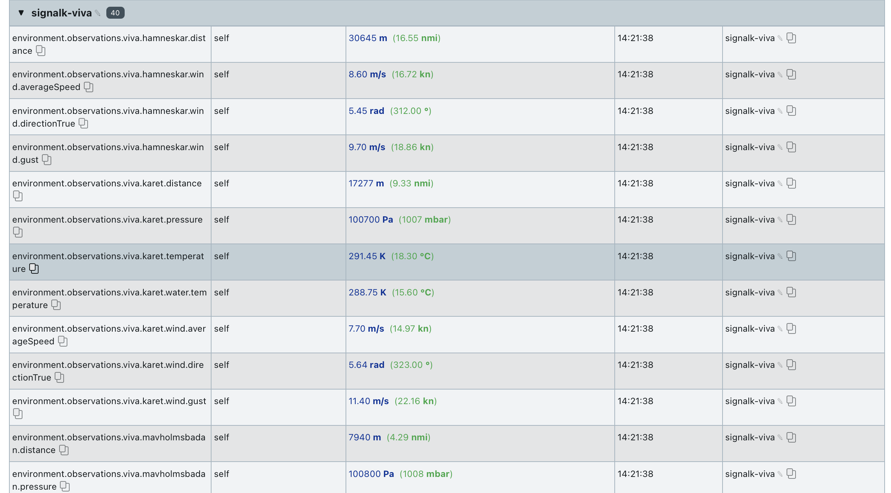
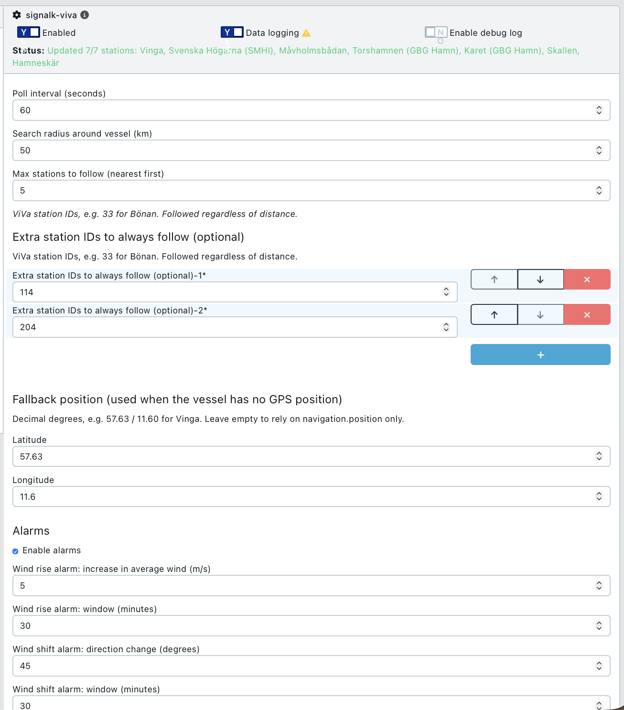

# signalk-viva-plugin
![alt text][logo]

[logo]: https://github.com/theseal666/signalk-viva-plugin/blob/main/signalK-viva-plugin_logo.png "Logo Title Text 2"


a plugin that scrapes data from the Svenska sjöfartsverket viva-system from a configurable number of stations around my location to monitor for wind, barometric pressure and visualize and with end goal - put alarms in place for sudden changes in conditions.

## What it does

- Reads your vessel position from Signal K and finds the nearest ViVa stations
  within a configurable radius (nearest first, up to a configurable count).
  Only stations that actually report **wind and/or air pressure** are selected —
  stations that only report water level or flow are skipped automatically.
- Re-discovers stations automatically when you have sailed more than ~10 km,
  so the set of stations follows you along the coast.
- Polls each station's JSON feed (no HTML scraping needed — same service the
  ViVa app uses) and publishes deltas in SI units.
- Watches for trouble and raises Signal K **notifications**:
  - **Wind rise** — average wind increased more than N m/s within a window
  - **Wind shift** — direction changed more than N degrees within a window
  - **Pressure drop** — pressure fell more than N hPa within a window

## Published paths

For each station, under `environment.observations.viva.<station>.`:

| Path suffix          | ViVa sample   | Units |
|----------------------|---------------|-------|
| `wind.averageSpeed`  | Medelvind     | m/s   |
| `wind.gust`          | Byvind        | m/s   |
| `wind.directionTrue` | Heading field | rad   |
| `pressure`           | Lufttryck     | Pa    |
| `temperature`        | Lufttemp      | K     |
| `water.temperature`  | Vattentemp    | K     |
| `water.level`        | Vattenstånd   | m     |
| `distance`           | — (great-circle distance from vessel to station, recalculated every poll) | m |

Example: `environment.observations.viva.bonan.wind.averageSpeed`

Live data in the Signal K Data Browser (here from Vinga and Svenska Högarna):



Alarms are published as standard Signal K notifications, e.g.
`notifications.environment.observations.viva.bonan.pressureDrop` with
`state: "alert"` and `method: ["visual", "sound"]`, and cleared with
`state: "normal"` when conditions ease (with a small hysteresis to avoid
flapping). Any notification-aware app — KIP, WilhelmSK, the server's built-in
alarm handling — will show and sound them.

## Configuration

In the Signal K admin UI under **Server → Plugin Config → Sjöfartsverket ViVa
observations**:

| Setting            | Default | Notes                                             |
|--------------------|---------|---------------------------------------------------|
| Poll interval      | 60 s    | ViVa stations update roughly every 1–10 minutes   |
| Search radius      | 50 km   | Around current vessel position                    |
| Max stations       | 3       | Nearest qualifying stations                       |
| Extra station IDs  | —       | Always followed, regardless of distance           |
| Fallback position  | —       | Used when there is no GPS position — handy at the dock or for testing |
| Wind rise alarm    | 5 m/s / 30 min  |                                           |
| Wind shift alarm   | 45° / 30 min    |                                           |
| Pressure drop alarm| 2 hPa / 120 min | ≥ 1 hPa/h sustained usually means real weather coming — tune to taste |

Alarm windows need at least half the window of collected history before they
can fire, so you won't get spurious alarms right after startup.



### Finding station IDs

Station list with IDs and positions:

```
https://services.viva.sjofartsverket.se:8080/output/vivaoutputservice.svc/vivastation/
```

Single station (this is what the plugin polls):

```
https://services.viva.sjofartsverket.se:8080/output/vivaoutputservice.svc/vivastation/33
```

## Visualization

- **KIP**: add gauges/wind steering displays on the
  `environment.observations.viva.*` paths — units and station names come from
  the published meta.
- **History/graphs**: pair with `signalk-to-influxdb2` + Grafana (great for
  watching the pressure trend), or KIP's built-in charts.

## Install

Install **signalk-viva** from the Signal K App Store (admin UI → Appstore),
or from npm:

```
npm install signalk-viva
```

or from source:

```
cd ~/.signalk/node_modules
git clone https://github.com/theseal666/signalk-viva-plugin.git signalk-viva
```

then restart the Signal K server and enable the plugin. Requires Node 18+
(uses the built-in `fetch`).

## Data source

Data comes from Sjöfartsverket's ViVa system via its public JSON service. The
service is unofficial/undocumented, so be gentle with poll intervals and
expect occasional format changes.
